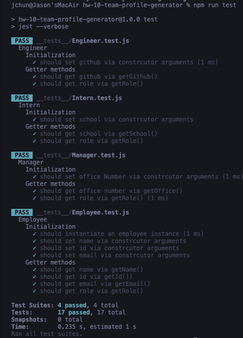

# Homework 10: Team Profile Generator

## Description

For this week's homework, we were assigned to create a Team Profile Generator with mainly JavaScript and some HTML to create a web page displaying the team using Node.js. 
As we had to create this application from scratch, I was a little worried as I don't feel 100% confident in using Node.js, but thankfully the Instructor (Trey) went over it with us on Sunday to explain everything!

## Installation

As this application is not deployed on the browser until the team members are created using Node, you'll have to fork or clone the Repo from my Github, and do `npm install inquirer jest` in the command line before being able to create a team.
- [My GitHub Repo](https://github.com/jasonchun7/hw-10-team-profile-generator)

## Usage 

Here is the link to the walkthrough video:
- [Full Demo](https://drive.google.com/file/d/15fM5n4rXcUBzDXgIzTROx4tv4ihuzN7g/view?usp=sharing)

How it works:
- First, you must open the command line and enter `node index.js` to start the prompts
```
node index.js
```
- You're first instructed to enter the manager's `name` for your team, followed by their `ID`, `email`, and `office number`.
- Then, you have a choice to add either an `engineer`, `intern`, or `no other members`.
- Selecting an engineer will prompt you to enter their `name`, `ID`, `email`, and `GitHub username`.
- Selecting an intern will prompt you to enter their `name`, `ID`, `email`, and the `school` they're attending.

## Credits

A huge thank you to Trey (Instructor) who took the time to walk us through the whole process of creating this application. From him, I definitely learned and have a more understanding of the function on Jest (test) and just how important it is to make sure everything passes every test before it is fully functionable.
Here is his GitHub Repo for reference:
- [Treyeckels: Team Builder](https://github.com/treyeckels/team-builder)

## Tests

For testing, we used the **Jest** module from npm, allowing us to test whatever we want necessary. 
To test all the JS files in the '__test__' folder, just type in `npm run test` in the command line.
